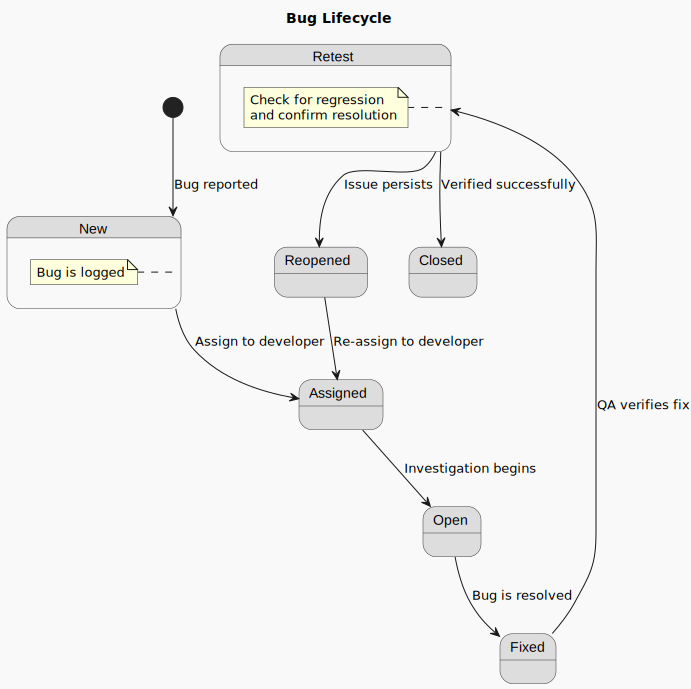

# Test Plan

## Table of Contents

 Click to expand

- [Test Plan](#test-plan)
  - [Table of Contents](#table-of-contents)
  - [Introduction](#introduction)
  - [Test Environment](#test-environment)
  - [Scope of Testing](#scope-of-testing)
    - [In-Scope Testing](#in-scope-testing)
      - [Functional Testing](#functional-testing)
      - [Non-Functional Testing](#non-functional-testing)
    - [Out-of-Scope Testing](#out-of-scope-testing)
  - [Test Objectives](#test-objectives)
  - [Test Strategy](#test-strategy)
  - [Test Cases](#test-cases)
  - [Test Reporting](#test-reporting)
  - [Bug lifecycle](#bug-lifecycle)
  - [Risks and Mitigation](#risks-and-mitigation)
  - [Conclusion](#conclusion)

## Introduction

This document outlines the test plan for the Bubble project. The goal of this test plan is to ensure that the Bubble project meets its requirements and functions as expected, while also identifying any potential issues or bugs. The test plan will cover various aspects of the project, including functionality, performance, security, and usability.

## Test Environment

The test environment for the Bubble project will consist of only one component: the Bubble project itself. As Bubble is a web-based application, the test environment will be set up on our computer directly. Tests will mainly be visual and human-based, as there are no automated tests available for the Bubble project. The test environment will be configured to simulate real-world usage scenarios and include various simulated devices to ensure compatibility and responsiveness across different platforms.

## Scope of Testing

The scope of testing of this project encompasses all key requirements pointed out by the client and mentionned in both functional and technical specifications. It will ensure the correctness of the application and its compliance with the specifications.

### In-Scope Testing

#### Functional Testing

Functional testing will be performed to ensure that the application meets its functional requirements. This includes testing the following features:

- Navigation between pages (home, profile, settings, etc.)
- Display and update of user profile data
- Integration with third-party services or APIs if applicable
- Responsive design across various screen sizes (mobile, tablet, desktop)

#### Non-Functional Testing

- Usability testing to ensure intuitive user experience
- Performance testing for acceptable load times and responsiveness
- Accessibility testing to verify compliance with WCAG guidelines

> [!NOTE]
> The WCAG (Web Content Accessibility Guidelines) is a set of guidelines for making web content more accessible to people with disabilities. It covers a wide range of recommendations for making web content more accessible, including text alternatives for non-text content, captions for audio and video content, and ensuring that all functionality is available from a keyboard.

### Out-of-Scope Testing

The following elements are outside the scope of this test plan:

- Automated testing (unit, integration, or end-to-end automation)
- Testing of infrastructure or server-side hosting environment
- Load testing at extreme traffic volumes (e.g., stress testing beyond expected usage)
- Penetration testing or in-depth cybersecurity audits
- Localization and internationalization testing (non-English language support)
- Testing on legacy browsers no longer supported (e.g., Internet Explorer)
- Testing of non-core modules or experimental features not required by the client

## Test Objectives

The objectives of the testing process is to rigorously evaluate that our MVP meets the requirements and objectives mentionned during the project kickoff, but also in the specifications.
Here's the list of objectives we will be testing:

- Verify that the application meets the functional requirements outlined in the specifications
- Ensure that the application is user-friendly and provides a positive user experience
- Validate that the application performs well under expected usage conditions
- Confirm that the application is accessible to users with disabilities
- Identify and document any defects or issues found during testing
- Provide feedback to the development team for continuous improvement
- Ensure that the application is ready for deployment and meets the client's expectations
- Validate that the application is compatible with various devices and screen sizes

## Test Strategy

The test strategy for the Bubble project will involve a combination of manual testing and exploratory testing. Given the nature of the project, automated testing is not feasible at this stage. The testing process will be divided into the following phases:

1. **Test Planning**: Define the scope, objectives, and strategy for testing.
2. **Test Design**: Create test cases and scenarios based on the requirements and specifications.
3. **Test Execution**: Execute the test cases and document the results.
4. **Defect Reporting**: Log any defects or issues found during testing and communicate them to the development team.
5. **Test Closure**: Evaluate the testing process, document lessons learned, and provide a final report to stakeholders.
6. **Regression Testing**: If any defects are fixed, perform regression testing to ensure that the fixes do not introduce new issues.
7. **User Acceptance Testing (UAT)**: Involve the client and various people that might be future users in testing to validate that the application meets their expectations and requirements.

## Test Cases

The test cases will be derived from the requirements and specifications of the Bubble project. Each test case will include the following information:

- Test Case ID
- Test Case Description
- Pre-conditions
- Test Steps
- Expected Results
- Actual Results
- Status (Pass/Fail)
- Comments/Notes

The test cases will be organized into categories based on the features being tested (development, design, etc.). Each test case will be executed manually, and the results will be documented in a test management tool or spreadsheet. The test cases will be reviewed and approved by the project manager and the tech lead before execution.

## Test Reporting

Each test cycle will be followed by a test report summarizing the testing activities, including:

- Test cases executed
- Test results (pass/fail)
- Defects found and their status
- Recommendations for improvements or fixes
- Overall assessment of the application's readiness for deployment

The test report will be shared with the project manager, development team, and other stakeholders to ensure transparency and facilitate communication. The report will also include any lessons learned during the testing process to improve future testing efforts.

## Bug lifecycle

In the context of software testing, the bug lifecycle refers to the various stages that a bug goes through from its discovery to its resolution. The bug lifecycle typically includes the following stages:

1. **New**: The bug is reported and logged in the bug tracking system.
2. **Assigned**: The bug is assigned to a developer or team for investigation and resolution.
3. **Open**: The developer begins working on the bug and investigates its root cause.
4. **Fixed**: The developer has implemented a fix for the bug and it is ready for testing.
5. **Retest**: The tester retests the bug to verify that it has been fixed and that the fix does not introduce new issues.

This PlantUML diagram illustrates the bug lifecycle:

As you can see, the bug lifecycle is a continuous process that involves multiple stages and interactions between testers and developers. The goal of the bug lifecycle is to ensure that bugs are identified, tracked, and resolved efficiently, leading to a higher quality software product.
The bug lifecycle is an essential part of the software development process, as it helps teams manage and prioritize bugs effectively. By following a structured bug lifecycle, teams can ensure that bugs are addressed in a timely manner and that the overall quality of the software is maintained.

## Risks and Mitigation

The following risks have been identified for the testing process, along with their mitigation strategies:

| Risk                                        | Likelihood | Impact | Mitigation Strategy                                                                          |
| ------------------------------------------- | ---------- | ------ | -------------------------------------------------------------------------------------------- |
| Limited test coverage due to manual testing | Medium     | High   | Prioritize critical features for testing and ensure comprehensive test cases are created.    |
| Resource availability (testers, developers) | Medium     | Medium | Ensure clear communication and scheduling to allocate resources effectively.                 |
| Defects found late in the process           | Low        | High   | Conduct early testing and continuous feedback loops to catch defects sooner.                 |
| Changes in requirements during testing      | Medium     | Medium | Maintain clear communication with stakeholders and adapt test cases as needed.               |
| Delays in defect resolution                 | Medium     | High   | Set clear timelines for defect resolution and prioritize critical issues.                    |
| Inadequate documentation of test results    | Low        | Medium | Use a standardized format for test case documentation and reporting.                         |
| Lack of user feedback during testing        | Medium     | High   | Involve end-users in User Acceptance Testing (UAT) to gather feedback and validate features. |
| Compatibility issues across devices         | Medium     | Medium | Test on a variety of devices and screen sizes to ensure compatibility and responsiveness.    |

## Conclusion

This test plan outlines the approach and strategy for testing the Bubble project to ensure it meets its requirements and functions as expected. By following this plan, we aim to deliver a high-quality application that provides a positive user experience and meets the client's expectations. The testing process will be conducted in a structured manner, with clear objectives, test cases, and reporting mechanisms to ensure transparency and effective communication among all stakeholders.
