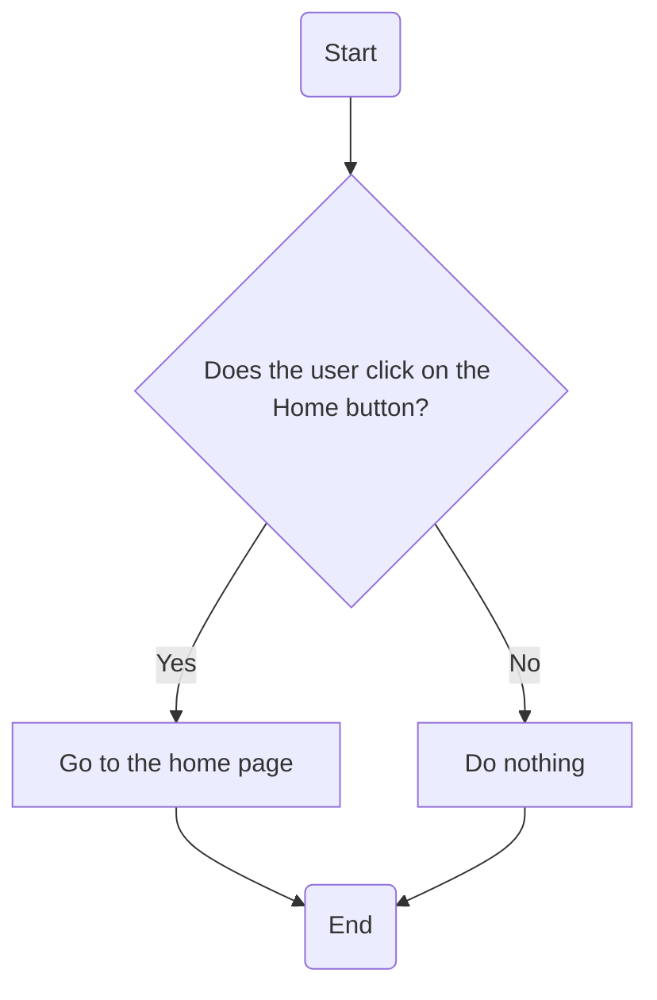
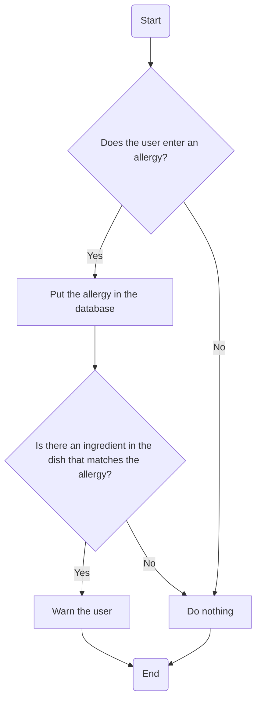

<div align=center>

# Technical Specification

---

**Project Name**: Bubble Intermarché <br>
**Team**: Team 2 <br>
**Created by**: Enoal ADAM <br>
**Creation Date**: 04/29/2025 <br>
**Updated**: 04/29/2025 <br>

---

</div>

<details>
<summary>Table of Contents</summary>

- [Technical Specification](#technical-specification)
  - [1. Introduction](#1-introduction)
  - [2. Objectives](#2-objectives)
  - [3. GitHub Folder Structure](#3-github-folder-structure)
  - [4. Conventions](#4-conventions)
  - [5. Requirements](#5-requirements)
  - [6. Architecture](#6-architecture)
    - [6.1 Technologies](#61-technologies)
    - [6.2 How will it work?](#62-how-will-it-work)
  - [7. Bubble Platform](#7-bubble-platform)
    - [7.1 Front-end](#71-front-end)
      - [7.1.1 Pages](#711-pages)
      - [7.1.2 Drag \& Drop Menu](#712-drag--drop-menu)
      - [7.1.3 Styles Menu](#713-styles-menu)
    - [7.2 Back-end](#72-back-end)
      - [7.2.1 Workflow Menu](#721-workflow-menu)
        - [A. What is it?](#a-what-is-it)
        - [B. The Logic of the Application](#b-the-logic-of-the-application)
      - [7.2.2 The Database](#722-the-database)
      - [7.2.3 The API Connector](#723-the-api-connector)
        - [A. What is it?](#a-what-is-it-1)
        - [B. How to connect to an external API?](#b-how-to-connect-to-an-external-api)
  - [8. Website Functionalities](#8-website-functionalities)
    - [8.1 Overview](#81-overview)
      - [8.1.2 The Launch Page](#812-the-launch-page)
      - [8.1.3 The Language Page](#813-the-language-page)
      - [8.1.4 The Home Page](#814-the-home-page)
      - [8.1.5 The Barcode Scanning Page](#815-the-barcode-scanning-page)

</details>

## 1. Introduction

The project goal is to develop with the Bubble technology[^1] a web application for the Intermarché St-Rémi-de-Provence supermarket. The application will allow customers to find cheeses and wines that pair well with the dishes they want to prepare (related to the ingredients there are in them). The application will be available in French as well as English.

## 2. Objectives

- 
- 
- 
- 
- 

## 3. GitHub Folder Structure

``` bash
2024-2025-project-5-bubble-intermarche-team-2
├── .github # GitHub folder for the project
│   ├── workflows # GitHub Actions folder -> Contain the scripts that will automatically run
│   │   └── main.yml # GitHub Actions script to merge the main branch into the sub-branches
│   │
│   └── ISSUE_TEMPLATE # GitHub issue template folder -> Contains the templates for issues
│
├── Documents # Stores all the documents related to the project
│   ├── Functional
│   │  ├── Images
│   │  └── functional_specification.md
│   │
│   ├── Technical
│   │  ├── Images
│   │  └── technical_specification.md
│   │
│   ├── Quality_Assurance
│   │  ├── Images
│   │  └── test_plan.md
│   │
│   ├── Management
│   │  ├── Images
│   │  ├── Management_Artifacts
│   │  └── Weekly_Reports
│   │
│   └── User_Manual
│      ├── Images
│      └── user_manual.pdf
│
├── Src # Stores the link to the Bubble project (since Bubble is a no-code platform)
│  └── bubble_project.md # Change this file name when we'll know how to name it
│
├── .gitignore # Ignore files and folders in the repository
└── README.md # Project description and instructions to run the project
```

## 4. Conventions

To ensure the coordination of the document, names and so on, conventions are set up in this project. Below are the conventions used in this project:

| Type              | Example Name          | Convention        |
| ----------------- | --------------------- | ----------------- |
| Files             | `file_name`           | snake_case        |
| Folders           | `Folder_Name`         | Pascal_Snake_Case |
| Document Titles   | `Wonderful Title`     | Title Case        |
| Web Pages         | `one_Page`            | camel_Snake_Case  |
| Group of Elements | `Answers Group`       | Title Case        |
| States            | `the_Best_State`      | camel_Snake_Case  |
| Databases         | `Incredible_Database` | Pascal_Snake_Case |
| Fields (Data)     | `best_data_ever`      | snake_case        |
| API Calls         | `GoodNameOfAPI`       | PascalCase        |

> [!caution] Elements Naming Conventions
> To avoid all misunderstandings regarding to an element in Bubble, the name of the element must be in **Title Case** preceded by its type (except for groups). <br>
> For example, if the element is an *Input*, its name should be "Input Zip Code".

<br>

## 5. Requirements

Before going further, it is highly recommended to read the [Functional Specification](../Functional/functional_specification.md) document. It contains all the necessary information about the requirements and can also help in understanding the rest of this document. <br>

## 6. Architecture

### 6.1 Technologies

The following technologies are used in this project:

- **Bubble**: No-code platform to develop the web application.
- **Bubble Plugin**: Additional plugins to enhance the application (e.g., API Connector, Google Maps, etc.).
- **Bubble Database**: Database to store the data of the application.

All these technologies are used directly on the Bubble platform. Therefore, there is no need to install anything more in the application. <br>

### 6.2 How will it work?

We will have to side on our application, a front-end side (the visible part of the application) and a back-end side (the database). <br>
As an **input** of the application, the app will ask the user to enter the name of the dish they want to prepare. The app then searches the database for the ingredients of that dish, if one exists, and displays a list of cheeses and wines that pair well with it. <br>
To find the best pairings, we will use the **API Connector** plugin to connect to an external API <!--(we need to find it)--> that provides information about cheeses and wines. As complementary information of this API, we will consult some of the most common association on an expert site. <br>
The **output** of the application will be the list of cheeses and wines displayed on the screen, the user interface (referred to the front-end above). 

## 7. Bubble Platform

Bubble is a no-code platform that allows to create web applications without any programming knowledge. To create an application, we place blocks, more precisely called elements, on a page and define their properties to create a rendering similar to an HTML page. <br>

### 7.1 Front-end

#### 7.1.1 Pages

If you want to create an application with multiple sections/pages, you must create them in the **Pages** menu. The particularity of Bubble is that you need to create a page like an HTML page for each new interface even if the application has only one but with multiple menus. <br>


#### 7.1.2 Drag & Drop Menu

To add an element (like we see at the top of the section), you can drag and drop it from the bar on the left side, as shown on the image. They act like flex containers in HTML, allowing you to group elements but also, put them in Row, Column with a Space Between each element in the container, and so on. <br>


#### 7.1.3 Styles Menu

The styles menu is used to customize the appearance of the elements in the application. You can change the font, color, size, and other properties of the elements. Changes made here apply to all elements of the same type (like a CSS tag in a style sheet). <br>


### 7.2 Back-end

#### 7.2.1 Workflow Menu

##### A. What is it?

The workflow menu is used to create the logic of the application. It allows you to define what happens when a user interacts with an element (e.g., clicking a button, entering text in an input field, etc.). <br>

##### B. The Logic of the Application

Examples of two workflows that will be used in the application:

- When the user clicks on the "Home" button in the Navbar, the app will navigate to the home page



- When the user enters that he has a allergy to a specific ingredient, the app will put it in the database and will warn the user that there is the ingredient in the dish he watches.



#### 7.2.2 The Database

The database is used to store all the data of the application. It is divided into different tables, each containing different fields. <br>

Here is an example of a table that will be used in the application:

- Recipes:
  - Name: The name of the recipe
  - Pictures: The pictures of the recipe
  - Category: The category of the recipe (e.g., starter, main course, dessert, etc.)
- Association:
  - Wine: The list of Wine Products that are stored in the database
  - Cheese: The list of Cheese Products that are stored in the database
  - Match Score: The score of the match between the cheese and the wine based on the external API and the expert site

#### 7.2.3 The API Connector

##### A. What is it?

The API Connector is a plugin that allows you to connect to external APIs. It is used to retrieve data from these and in this case, store them in the database in order to reutilize these data for matching score between recipes and wines/cheeses. <br>

##### B. How to connect to an external API?

As on the image below, you firstly need to call the API. To do that, you have to give a name to the API and the call. Then, as usual in a programming language, you must define the method (GET, POST, etc.) and the URL of the API but with the particularity that you need to remove the parameters and replace them by brackets and define a pair key-value for each parameters. Finally, as in the C++ language, you can define the visibility of the parameters (private or public).


## 8. Website Functionalities

### 8.1 Overview

The website will have 5 main pages (available in all the languages of the application) which are:

- The Launch Page
- The Language Page
- The Home Page
- The Barcode Scanning Page
- The Product Page
- The Localization Page

Each following sections will talk about one of these pages.

#### 8.1.2 The Launch Page

The launch page is the first page that the user will see when he opens the application. It will contain the logo of the app and to access the language page, you need to click anywhere on the screen. <br>

#### 8.1.3 The Language Page

The language page is the second page that the user will see. The flags represent the languages available in the application that the user can choose. The user can click on the flag of the language he wants to use and then, he will be redirected to the home page in this language. <br>

#### 8.1.4 The Home Page

The home page is the main page of the application. In it, the user will retrieve the Best Sellers for Cheeses, Wines and recommendations of Recipes which goes well with the best sellers. If the user press one of the button in the form of the list above, he will be redirected to the product/recipe page allow him to see the description as well as have a better view of it. <br>

#### 8.1.5 The Barcode Scanning Page
