<div align=center>

# Technical Specification

---

**Project Name**: Bubble Intermarché <br>
**Team**: Team 2 <br>
**Created by**: Enoal ADAM <br>
**Creation Date**: 04/29/2025 <br>
**Updated**: 05/26/2025 <br>

---

</div>

<details>
<summary>Table of Contents</summary>

- [Technical Specification](#technical-specification)
  - [1. Introduction](#1-introduction)
  - [2. Objectives](#2-objectives)
  - [3. GitHub Folder Structure](#3-github-folder-structure)
  - [4. Conventions](#4-conventions)
  - [5. Requirements](#5-requirements)
  - [6. Architecture](#6-architecture)
    - [6.1 Technologies](#61-technologies)
    - [6.2 How will it work?](#62-how-will-it-work)
  - [7. Bubble Platform](#7-bubble-platform)
    - [7.1 Front-end](#71-front-end)
      - [7.1.1 Pages](#711-pages)
      - [7.1.2 Drag \& Drop Menu](#712-drag--drop-menu)
      - [7.1.3 Styles Menu](#713-styles-menu)
    - [7.2 Back-end](#72-back-end)
      - [7.2.1 Workflow Menu](#721-workflow-menu)
        - [7.2.1.A. What is it?](#721a-what-is-it)
        - [7.2.1.B. The Logic of the Application](#721b-the-logic-of-the-application)
      - [7.2.2 The Database](#722-the-database)
  - [8. Website Functionalities](#8-website-functionalities)
    - [8.1 Overview](#81-overview)
      - [8.1.1 The Launch Page](#811-the-launch-page)
      - [8.1.2 The Home Page](#812-the-home-page)
      - [8.1.3 The Barcode Scanning Page](#813-the-barcode-scanning-page)
      - [8.1.4 The Catalog Page](#814-the-catalog-page)
      - [8.1.5 The Localization Page](#815-the-localization-page)
      - [8.1.6 The Product Pop-up](#816-the-product-pop-up)
      - [8.1.7 The Recipe Pop-up](#817-the-recipe-pop-up)
      - [8.1.8 The Language Dropdown](#818-the-language-dropdown)
    - [8.2 Functionalities](#82-functionalities)
      - [8.2.1 The Launch Page](#821-the-launch-page)
      - [8.2.2 The Home Page](#822-the-home-page)
        - [8.2.2.A. The Best Sellers](#822a-the-best-sellers)
        - [8.2.2.B. Repeating Group](#822b-repeating-group)
      - [8.2.3 The Barcode Scanning Page](#823-the-barcode-scanning-page)
      - [8.2.4 The Catalog Page](#824-the-catalog-page)
        - [8.2.4.A. The SearchBox](#824a-the-searchbox)
        - [8.2.4.B. Filtering Products](#824b-filtering-products)
      - [8.2.5 The Localization Page](#825-the-localization-page)
        - [8.2.5.A. The SearchBox](#825a-the-searchbox)
        - [8.2.5.B. The Map](#825b-the-map)
        - [8.2.5.C. The Workflow for the Localization Page](#825c-the-workflow-for-the-localization-page)
      - [8.2.6 The Product Pop-up](#826-the-product-pop-up)
      - [8.2.7 The Recipe Pop-up](#827-the-recipe-pop-up)
      - [8.2.8 The Language Dropdown](#828-the-language-dropdown)
  - [9. Glossary](#9-glossary)

</details>

## 1. Introduction

The project goal is to develop a web application using Bubble[^1] for the Intermarché St-Rémi-de-Provence supermarket. The application will allow customers to find cheeses and wines that pair well with the dishes they want to prepare (related to the ingredients they contain). The application will be available in many languages.

## 2. Objectives

- **It must be a mobile app**, ensuring offline access, geolocation, and preferences registration.
- **The app should open swiftly** so they can access functionalities directly instead of taking time to log in/sign up and buying what they want.
- **The app must be user-friendly** to make sure the user doesn't get lost in the app.
- **Multiple languages must be implemented** for a wider public due to the touristic flux of the region.

## 3. GitHub Folder Structure

``` bash
2024-2025-project-5-bubble-intermarche-team-2
├── .github # GitHub folder for the project
│   ├── workflows # GitHub Actions folder -> Contain the scripts that will automatically run
│   │   └── main.yml # GitHub Actions script to merge the main branch into the sub-branches
│   │
│   └── ISSUE_TEMPLATE # GitHub issue template folder -> Contains the templates for the issues
│
├── Documents # Stores all the documents related to the project
│   ├── Functional
│   │  ├── Images
│   │  └── functional_specification.md
│   │
│   ├── Technical
│   │  ├── Images
│   │  └── technical_specification.md
│   │
│   ├── Quality_Assurance
│   │  ├── Images
│   │  └── test_plan.md
│   │
│   ├── Management
│   │  ├── Images
│   │  ├── Management_Artifacts
│   │  └── Weekly_Reports
│   │
│   └── User_Manual
│      ├── Images
│      └── user_manual.pdf
│
├── Src # Stores the link to the Bubble project (since Bubble is a no-code platform)
│  └── bubble_project.md # Link to the Bubble project
│
├── .gitignore # Ignore files and folders in the repository
└── README.md # Project description and instructions to run the project
```

## 4. Conventions

To ensure the coordination of the document, names, and so on, conventions are set up in this project. Here are these conventions:

| Type              | Example Name          | Convention        |
| ----------------- | --------------------- | ----------------- |
| Files             | `file_name`           | snake_case        |
| Folders           | `Folder_Name`         | Pascal_Snake_Case |
| Document Titles   | `Wonderful Title`     | Title Case        |
| Web Pages         | `one_page`            | snake_case        |
| Group of Elements | `Answers Group`       | Title Case        |
| States            | `the_Best_State`      | camel_Snake_Case  |
| Databases         | `Incredible_Database` | Pascal_Snake_Case |
| Fields (Data)     | `best_data_ever`      | snake_case        |
| API Calls         | `GoodNameOfAPI`       | PascalCase        |

> [!caution] 
> **Elements Naming Conventions:** <br>
> To avoid all misunderstandings regarding an element in Bubble, the name of the element must be in **Title Case** preceded by its type (except for groups). <br>
> For example, if the element is an *Input*, its name should be "Input Zip Code".

<br>

## 5. Requirements

Before going further, it is highly recommended to read the [Functional Specifications](../Functional/functional_specifications.md) document. It contains all the necessary information about the requirements and can also help in understanding the rest of this document. <br>

## 6. Architecture

### 6.1 Technologies

The following technologies are used in this project:

- **Bubble**: No-code platform to develop the web application.
- **Bubble Plugin**: Additional plugins to enhance the application (e.g., API Connector, Barcode Scanner, etc.).
- **Bubble Database**: Database to store the data of the application.

All these technologies are used directly on the Bubble[^1] platform. Therefore, there is no need to install anything more in the application. <br>

### 6.2 How will it work?

We will have two sides on our application, a front-end side (the visible part of the application) and a back-end side (the database + all the workflows). <br>
- As an **input** of the application, we will have the user who will interact with the application. The user will be able to enter data (e.g., scan a barcode, search for a *cheese or wine* product, etc.) and the application will process these data to provide the desired output. <br>
- The **output** of the application will be the data displayed to the user (e.g., recipes, products, etc.) and the actions performed by the application (e.g., store data in the database, execute workflow[^2], etc.). <br>

## 7. Bubble Platform

Bubble[^1] is a no-code platform that allows the creation of web applications without any programming knowledge. To create an application, we place blocks, more precisely called **elements**, on a page and define their properties to create a rendering similar to an HTML[^3] page. <br>

### 7.1 Front-end

#### 7.1.1 Pages

If you want to create an application with multiple sections/pages, you must create them in the **Pages** menu. The particularity of Bubble[^1] is that you need to create a page like an HTML[^3] page for each new interface even if the application has only one but with multiple menus. <br>


#### 7.1.2 Drag & Drop Menu

To add an element (as we see at the top of the section), you can drag and drop it from the bar on the left side, as shown in the image. They act like flex containers[^4] in HTML[^3][^4], allowing you to group elements but also, put them in a Row, Column with a Space Between each element in the container, and so on. <br>


#### 7.1.3 Styles Menu

The styles menu is used to customize the appearance of the elements in the application. You can change the font, color, size, and other properties of the elements. Changes made here apply to all elements of the same type (like a CSS tag[^5] in a style sheet). <br>


### 7.2 Back-end

#### 7.2.1 Workflow Menu

##### 7.2.1.A. What is it?

The workflow[^2] menu is used to create the logic of the application. It allows you to define what happens when a user interacts with an element (e.g., clicking a button, entering text in an input field, etc.). <br>

##### 7.2.1.B. The Logic of the Application

1. The Sidebar

<ins>1.1. Explanation of the Sidebar</ins>

- When the user clicks on the "Home" button in the Sidebar, the app will navigate to the home page.

- When the user clicks on the "QR Code" button in the Sidebar, the app will navigate to the QR Code reader page

- When the user clicks on the "Catalog" button in the Sidebar, the app will navigate to the catalog page.

- When the user clicks on the "Localization" button in the Sidebar, the app will navigate to the localization page.

<ins>1.2. Workflow of the Sidebar</ins>


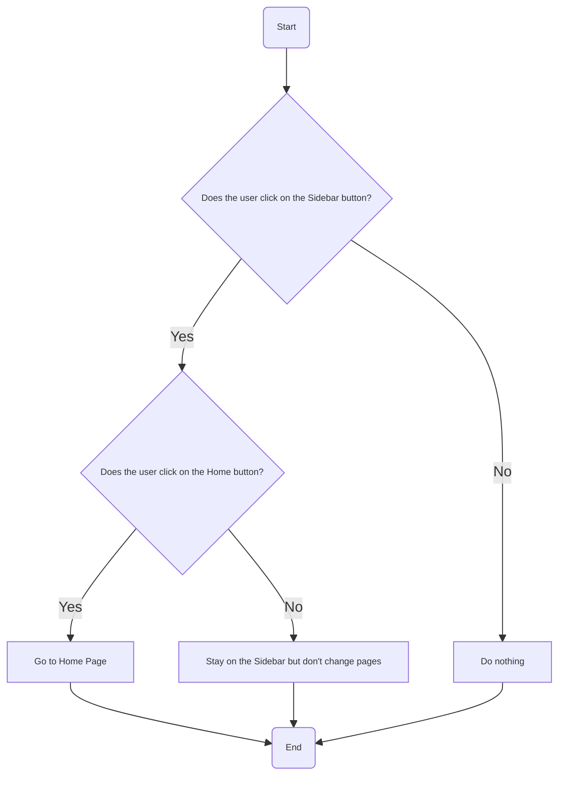

<br><br>

2. The pop-ups

When the user clicks on a recipe or product on the home page or catalog, the application will display a pop-up window with the details of these (depending on what was chosen).

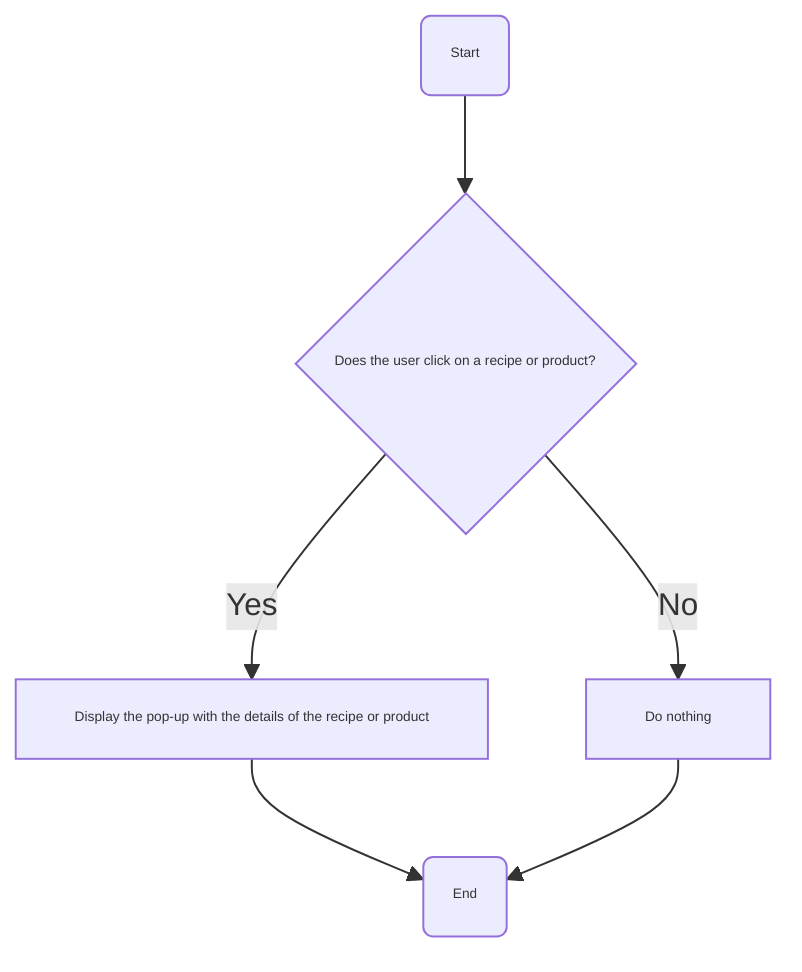
<br>
In the same way, the pop-up is closable. To do that, the user has to click on the "Close" button.

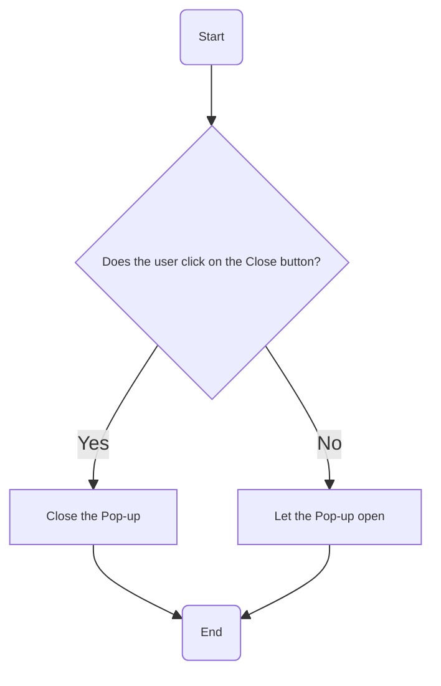
<br><br>

3. The Matching System

<u>3.1. Matching for a Product</u>

- When a cheese is selected by the user, 4 recipes and 4 wines will be recommended based on a matching rank (from 1 to 5).
- Also, when a wine is selected by the user, 4 recipes and 4 cheeses will be recommended based on the same matching rank.

Here is the workflow[^2] for the wine matching:

<br>

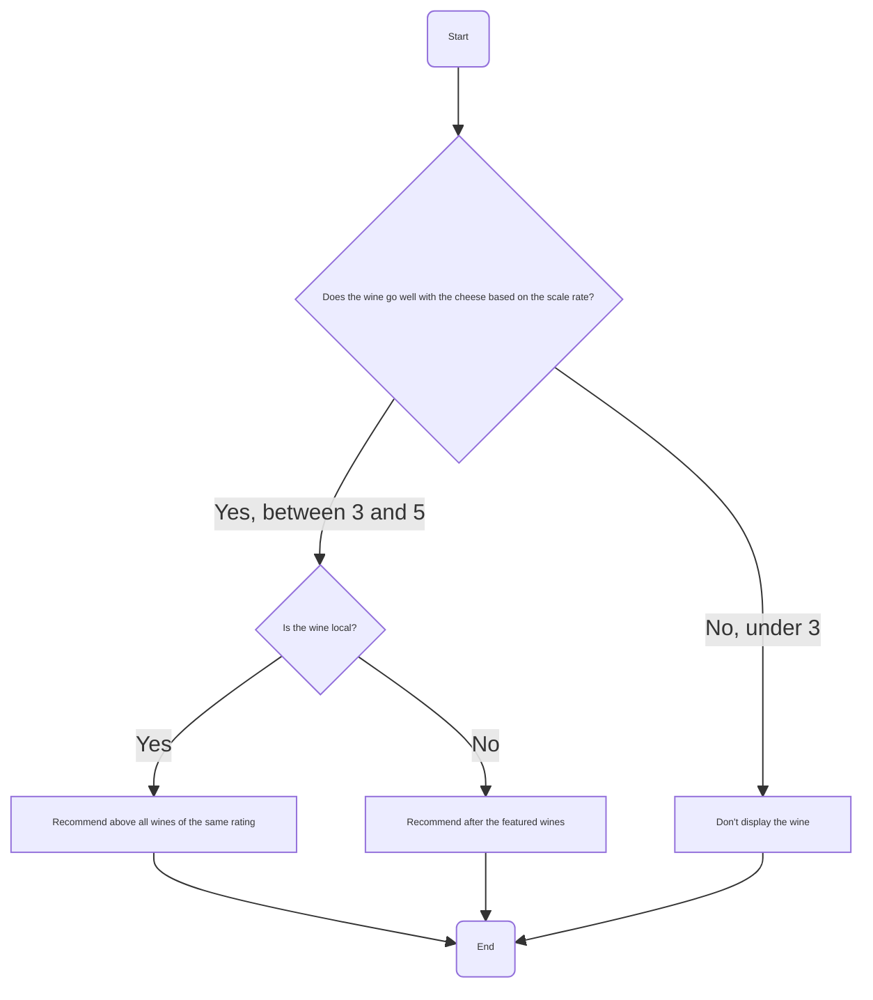

*Note that the same workflow[^2] will be used for the cheese. To see it, just replace the word "wine" by "cheese".*

<br>

<u>3.2. Matching for a Recipe</u>
    
When a recipe is selected by the user, 4 cheeses and 4 wines will be recommended always based on this matching rank but for this one, the workflow[^2] is a bit different.

Here is the workflow[^2] for the recipe:

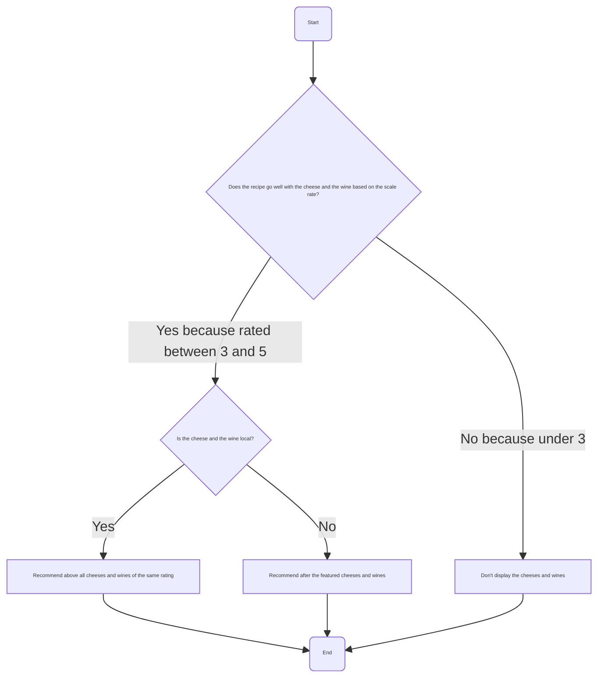

*Note that there will be 2 separate recommendation sections in the Recipe Pop-up: one for wine and one for cheese*

<br>

#### 7.2.2 The Database

The database is used to store all the data of the application. It is divided into different tables, each containing different fields. <br>

Here is an example of a table that will be used in the application:

- Recipes:
  - Name: The name of the recipe
  - Pictures: The pictures of the recipe
  - Category: The category of the recipe (e.g., starter, main course, dessert, etc.)
- Matching:
  - Wine: The list of Wine Products that are stored in the database
  - Cheese: The list of Cheese Products that are stored in the database
  - Recipe: The list of Recipes that are stored in the database
  - Match Score: The score of the match between the cheese and the wine based on the external API and the expert site


## 8. Website Functionalities

### 8.1 Overview

The website will have 5 main pages, 2 Pop-ups and 1 Dropdown (available in all the languages of the application) which are:

- The Launch Page
- The Home Page
- The Barcode Scanning Page
- The Catalog Page
- The Localization Page
- The Product Pop-up
- The Recipe Pop-up
- The Language Dropdown

Each following section will talk about one of these pages.

#### 8.1.1 The Launch Page

The launch page is the first page that the user will see when he opens the application. It will contain the logo of the app and to access the home page, you need to click anywhere on the screen. <br>

#### 8.1.2 The Home Page

The home page is the main page of the application. In it, the user will retrieve the Best Sellers for Cheeses, Wines, and recommendations of Recipes that go well with the best sellers. If the user presses one of the buttons in the form of the list above, the product/recipe pop-up will be displayed, allowing him to see the description as well as have a better view of it. <br>

#### 8.1.3 The Barcode Scanning Page

This page is used by the client to scan the barcode of a product. The app will then display the scanned product's information below. This possibility to scan the barcode is made possible thanks to a plugin in Bubble[^1]. <br>

#### 8.1.4 The Catalog Page

The catalog is used to display all the products available in the application. The user can filter the products by category (cheese, wine) and sub-categories (e.g., White Wine, Cow's Cheese, etc.) and then search for a specific product. Like in the Home Page, if the user clicks on a product, it will display the related pop-up. <br>

#### 8.1.5 The Localization Page

The localization page is used to find a product in the supermarket, more specifically to find the aisle where the product is located. It will work like the catalog. The user can search for a product by entering its name in the search bar and then clicking on the product overlay related to what is entered. <br>

#### 8.1.6 The Product Pop-up

On the product pop-up, the user will see the description of the product (wine or cheese) as well as the list of recipes that go well with it. The user can then click on one of the recipes to see its details. <br>

#### 8.1.7 The Recipe Pop-up

The recipe pop-up allows you to see a list of wines and cheeses that pair well with the dish and its description. To access it, the user must click on the desired recipe. <br> 

#### 8.1.8 The Language Dropdown

The language dropdown is used to change the language of the application. The user can choose between all the languages that exist on Google Translate thanks to a plugin[^6]. <br>

### 8.2 Functionalities

Now that we have seen the pages of the application, let's see the functionalities of each one.

#### 8.2.1 The Launch Page

When the user is on the launch page, a workflow[^2] is triggered to redirect the user to the language page when he clicks anywhere on his screen.

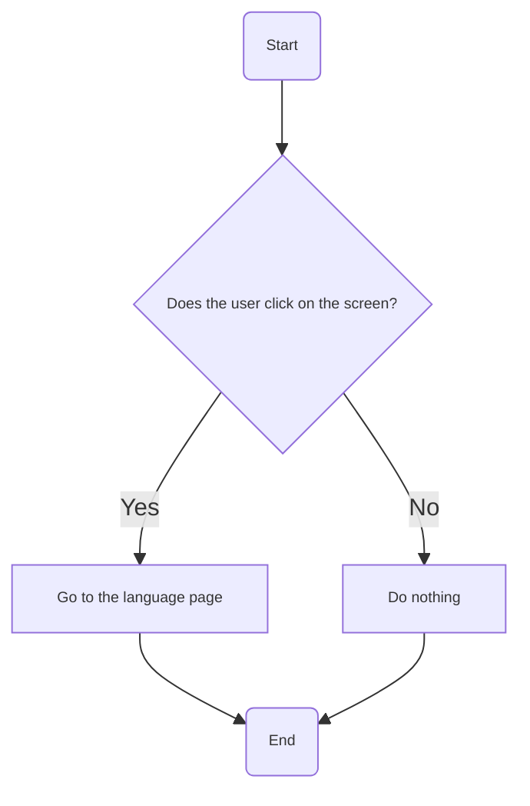

#### 8.2.2 The Home Page

##### 8.2.2.A. The Best Sellers

As explained above, on the home page, the user can see the best sellers for cheeses, wines, and recipes. To allow the user to click on one of the buttons and go to the associated page, a workflow[^2] is triggered at this precise moment.

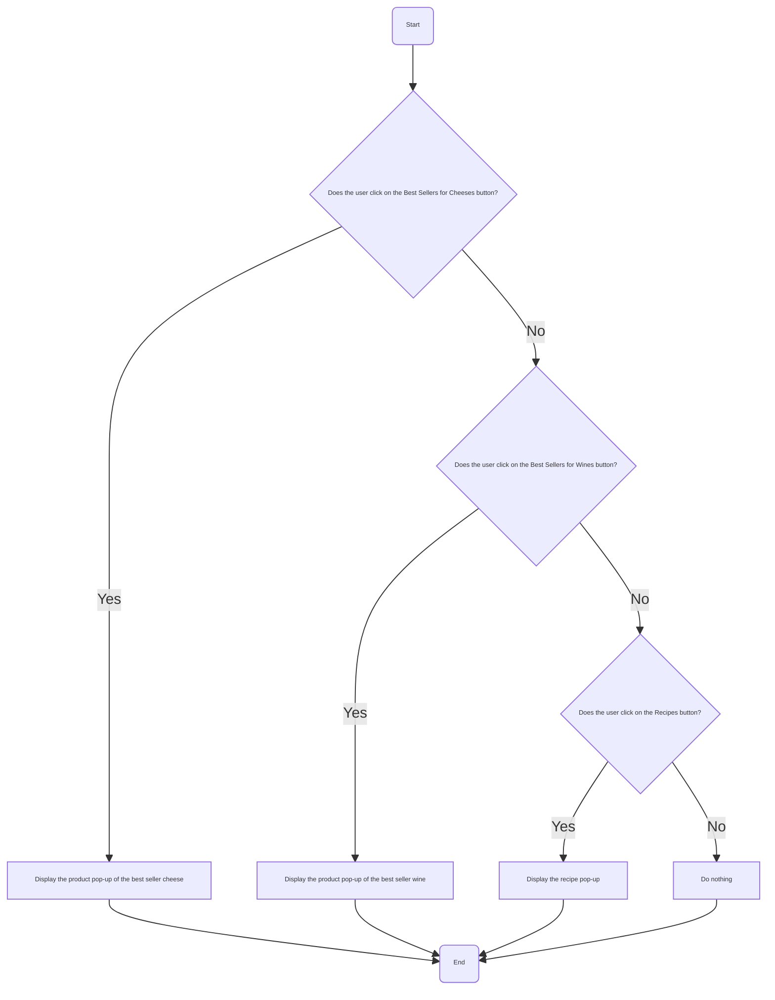

##### 8.2.2.B. Repeating Group

Additionally, from the developer's point of view, it will be decided to use the **Repeating Group** element to display best sellers. This element allows Bubble[^1] to display a list of items in a row without having to configure each display one by one. The data source for the repeating group will be the database containing cheeses, wines (with the attribute *yes* to "best sellers"), and the recipe database. <br>

#### 8.2.3 The Barcode Scanning Page

When the user clicks on the related icon on the navigation bar, the app will redirect him to the barcode scanning page. Once on it, the plugin[^6] "Barcode Scanner" will be started after clicking on a button to launch it. After the scan, the plugin[^6] will return the EAN code of the product (in the background) and match it to the database. If the product is in the database, the app will display the information of the scanned product just below. <br>

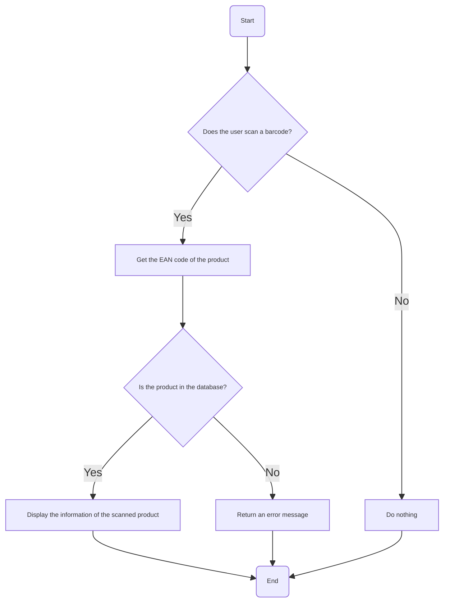

#### 8.2.4 The Catalog Page

##### 8.2.4.A. The SearchBox

To find a product in the catalog, the user enters its name in the search bar. To do this, from a developer's point of view, we will use the **SearchBox** element. What differentiates it from traditional input is that it functions as a search engine rather than just a simple input form. Indeed, when you start typing a word in the search bar, a dropdown menu appears just below where you type. This dropdown menu contains the list of products matching the entered word and the user can click on one of these products to display it in the Catalog and click on it to obtain its information. <br>

##### 8.2.4.B. Filtering Products

On the catalog page, the user can filter products by category and sub-category. To do this, we will use the **Dropdown** element and search for all categories (and sub-categories) saved in the database, then list them in the dropdown.

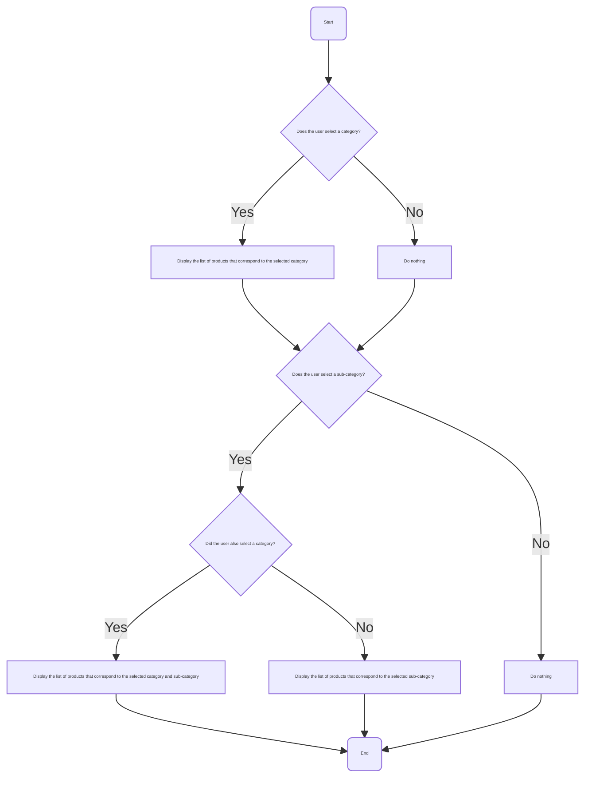

#### 8.2.5 The Localization Page

##### 8.2.5.A. The SearchBox

To find a product in the supermarket, the user can enter its name in the search bar. To do this, from a developer's perspective, we will use the **SearchBox** element. The tool being the same as before in the Catalog Page, we will skip the explanations. However, the dropdown menu of this page is quite different from the previous one. It contains the list of products matching the entered word and the user can click on one of these products to display its information as well as its **location**. <br>

##### 8.2.5.B. The Map

Regarding the map, all information related to the location of products in the supermarket is stored in the database. Once the user clicks on a product in the dropdown menu, the application displays the map with its location in the supermarket. <br>

##### 8.2.5.C. The Workflow for the Localization Page

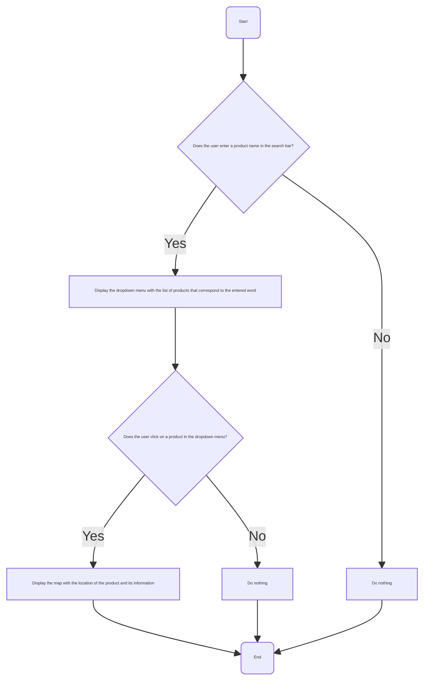

#### 8.2.6 The Product Pop-up

When the user clicks on a product on the home page, the app will display a pop-up with information about the product (wine or cheese) as well as the list of recipes that go well with it. <br>

About the workflow[^2], it is indicated in the [**The pop-ups apparition** section](#b-the-logic-of-the-application). <br>

#### 8.2.7 The Recipe Pop-up

On the home page or in the Product Pop-up, it is possible to click on a specific recipe. When it's done, the app will display a pop-up with the list of wines and cheeses that go well with the recipe as well as its description and name (according to the database). <br>

As for the product pop-up, the workflow[^2] is the same as the one in [**The pop-ups apparition** section](#721-workflow-menu). <br>

#### 8.2.8 The Language Dropdown

This dropdown will be available on all pages of the application. For this, we will use the **Language Translation** plugin[^6]. When the user clicks on the dropdown, a list of languages will appear. The user can then select the desired language and the application will be automatically translated into that language. To do that, the plugin[^6] will call a JS[^7] script that integrates a translate widget which is part of the GTranslate[^8] service. <br>

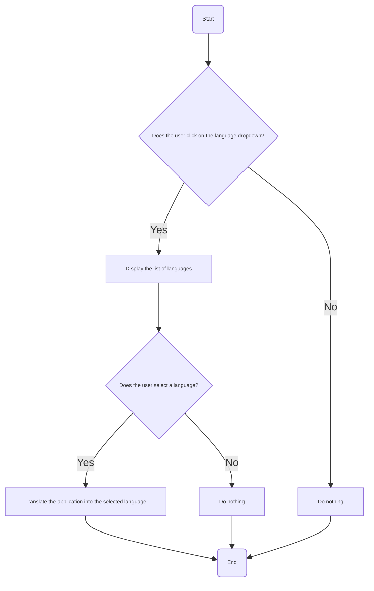

## 9. Glossary

[^1]: Bubble:
A no-code platform that allows users to create web applications without writing code. It provides a visual interface to design and develop applications using drag-and-drop elements, workflows, and a database.

[^2]: Workflow: 
A workflow is a series of actions that are executed in response to an event (e.g., a user logging in, search for a product in a search bar, etc.).

[^3]: HTML: 
*(aka HyperText Markup Language)* | The standard markup language for documents designed to be displayed in a web browser.

[^4]: Flex containers:
A container that uses the CSS Flexbox layout model to arrange its children elements.

[^5]: CSS: 
*(aka Cascading Style Sheets)* | A style sheet language used for describing the presentation of a document written in HTML or XML.

[^6]: Plugin:
An add-on that extends the functionality of Bubble by adding tools or services.

[^7]: JS: 
*(aka JavaScript)* | A programming language commonly used in web development to add interactivity to web pages, such as animations, form validations, dynamic content updates, and more.

[^8]: GTranslate: 
A website translation tool that makes any HTML site multilingual. It uses machine translation or neural network translation to instantly translate a site's content. In our case, we will use the machine translation (Google Translate) because it is the free version of the plugin.